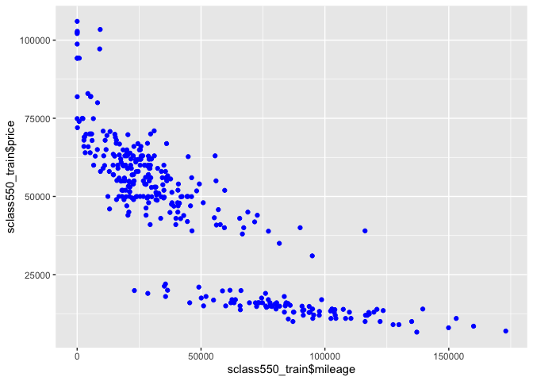

### The Variables involved

    ##        id             trim         subTrim      condition    isOneOwner
    ##  Min.   :    2   550    :21836   Hybrid:  190   CPO : 3586   f:25340   
    ##  1st Qu.:13231   430    : 2071   unsp  :29276   New :10317   t: 4126   
    ##  Median :26254   500    : 2002                  Used:15563             
    ##  Mean   :26269   63 AMG : 1413                                         
    ##  3rd Qu.:39293   600    :  527                                         
    ##  Max.   :52572   350    :  416                                         
    ##                  (Other): 1201                                         
    ##     mileage            year          color        displacement  
    ##  Min.   :     1   Min.   :1988   Black  :12838   4.6 L  :13599  
    ##  1st Qu.:    14   1st Qu.:2007   Silver : 6095   5.5 L  : 9154  
    ##  Median : 26120   Median :2012   White  : 4418   4.3 L  : 2071  
    ##  Mean   : 40387   Mean   :2010   Gray   : 2007   5.0 L  : 2002  
    ##  3rd Qu.: 68234   3rd Qu.:2015   Blue   : 1599   6.0 L  :  403  
    ##  Max.   :488525   Max.   :2015   unsp   : 1467   6.3 L  :  391  
    ##                                  (Other): 1042   (Other): 1846  
    ##        fuel           state           region              soundSystem   
    ##  Diesel  :  312   CA     : 5262   SoA    :7805   Alpine         :    2  
    ##  Gasoline:28628   FL     : 3559   Pac    :5844   Bang Olufsen   :  177  
    ##  Hybrid  :  189   NY     : 2754   Mid    :5824   Bose           :  943  
    ##  unsp    :  337   TX     : 2458   WSC    :2865   Boston Acoustic:    1  
    ##                   NJ     : 2266   ENC    :2496   Harman Kardon  : 4120  
    ##                   GA     : 1408   New    :1421   Premium        : 9694  
    ##                   (Other):11759   (Other):3211   unsp           :14529  
    ##    wheelType       wheelSize      featureCount        price       
    ##  Alloy  :14565   unsp   :25293   Min.   :  0.00   Min.   :   599  
    ##  Chrome :   80   18     : 1774   1st Qu.: 18.00   1st Qu.: 28995  
    ##  Premium:  424   19     : 1297   Median : 53.00   Median : 56991  
    ##  Steel  :   49   20     :  813   Mean   : 46.48   Mean   : 67001  
    ##  unsp   :14348   17     :  149   3rd Qu.: 70.00   3rd Qu.:108815  
    ##                  16     :  107   Max.   :132.00   Max.   :299000  
    ##                  (Other):   33

* Make a train-test split
* Define a helper function for calculating RMSE
* Create and set up the empty set ‘knn\_results’ to save values of ‘k’
* Run a loop of k values
* Look at price vs mileage for each trim level

* Find the optimal k
* Regress on optimal value of k
* Plot the fitted model

