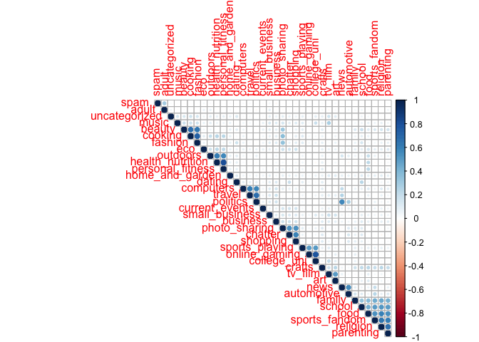
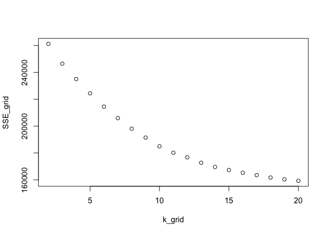
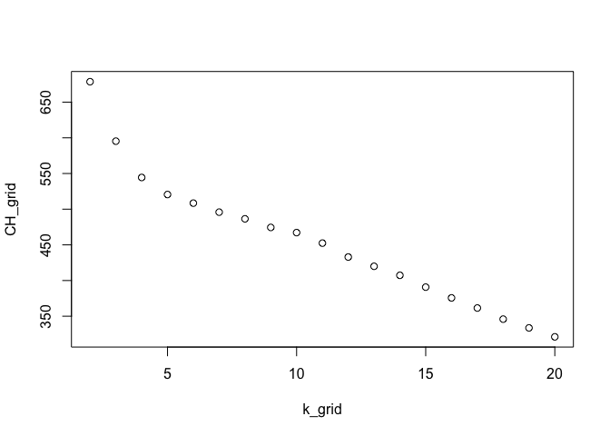
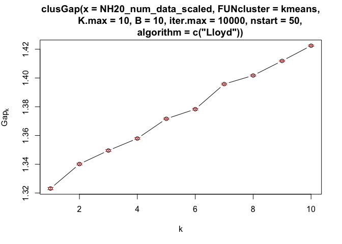
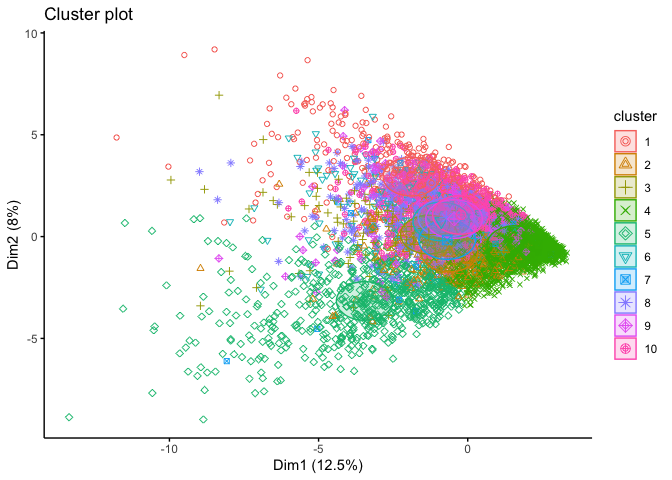
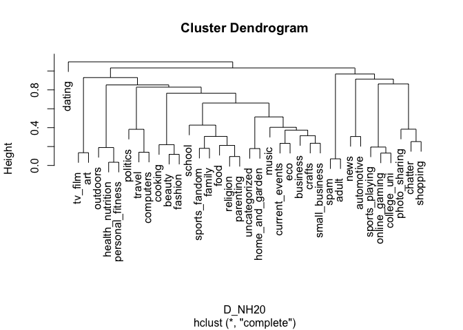

Q4 NutrientH20 : Market Segmentation Analysis
---------------------------------------------

The goal is to identify market segments for the Company so that it knows
what appeals to the consumers categorically. We therefore need to see if
we can put variables in boxes to give us a general idea of the nature of
the people that dictate these boxes. We do this through three steps and
two methods:

**Step 1: Find if some variables are highly correlated to see if we can
box them together maybe** **Step 2, Mehtod 1: Make boxes through
clustering (by kmeans) and report the resulting market segments.**
**Step 3, Method 2: Make Principle Components and report the market
segments.**

Step 1: Correlation between variables
=====================================

    ## Warning in text.default(pos.xlabel[, 1], pos.xlabel[, 2], newcolnames, srt
    ## = tl.srt, : "NH20_num_data.p" is not a graphical parameter

    ## Warning in text.default(pos.ylabel[, 1], pos.ylabel[, 2], newrownames, col
    ## = tl.col, : "NH20_num_data.p" is not a graphical parameter

    ## Warning in title(title, ...): "NH20_num_data.p" is not a graphical
    ## parameter

There are a lot of combinations.We can use some of these when we make
boxes and would want to combine them through multicorrelation between
the variables.

Step 2, Method 1: Clustering through k-means
============================================

Once we scale and center the data, we need to decide how many clusters
do we want. This is done. We try three methods to figure out the number
of ‘K’.

**1. Elbow Method**

    ##           used  (Mb) gc trigger  (Mb) limit (Mb) max used  (Mb)
    ## Ncells 2247621 120.1    3834977 204.9         NA  3834977 204.9
    ## Vcells 4256806  32.5   10146329  77.5      16384  8385685  64.0

Conclusion: K = 10 *Since this is based on a visual representation of
the Elbow, I would like to verify this with another method.*

**2. CH Grid Method**

    ## Warning: did not converge in 100 iterations

    ## Warning: did not converge in 100 iterations

Conclusion: K = 2 *Not as realistic.*

**3. The Gap Statistic**

Conclusion: K = 10

Since two of the three methods suggest K to be at 10, we will proceed
with this number.

Finally, we make 10 clusters.

We analyse the cluster through their center means and categorize our
market segment boxes accordingly.

7 Market segments recognised out of 10 clusters:

**1. Cluster 1 (Art seekers)** - These people showed an interest in
tv-film, music and art.

**2. Cluster 2 (The Dark end)** - Adult and spam tweets that were
unfiltered out of the data set.

**3. Cluster 3 (Family/ Household enthusiasts)** - These people showed
an interest in Food, Family, Parenting, Religion, School and
Sports-fandom.

**4. Cluster 4 & 7 (Inquisitives)** -These people showed an interest in
Travel, Politics, News and Computers. *(Cluster 7 reported tweets
interested in just News and Politics, so I merged it into one segment)*

**5. Cluster 5 (Fitness Enthusiasts)** - These people showed an interest
in Outdoors, Health & Nutrition and Personal fitness.

**6. Cluster 6 & 10 (Social Media enthusiasts)** - These people showed
an interest in Photo-sharing, Fashion, Beauty, Cooking, Shopping and
Chatter. *(Another cluster reported tweets interested in Chatter,
Photo-sharing and Shopping, so I merged it into one segment because of a
high multicorrelation between chatter, photo-sharing, shopping and
beauty)*

**7. Cluster 9 (Young sports enthusiasts)** - These people showed an
interest in College uni, Sports playing and Online gaming.

Step 3, Method 2: PCA clustering
================================

We use heirarchical clustering i.e the Cluster Dendogram Model that uses
the PCAs to form clusters and make market segments accordingly.

    pr_NH20 = prcomp(NH20_num_data_scaled)
    summary(pr_NH20)

    ## Importance of components:
    ##                           PC1     PC2     PC3     PC4     PC5     PC6
    ## Standard deviation     2.1186 1.69824 1.59388 1.53457 1.48027 1.36885
    ## Proportion of Variance 0.1247 0.08011 0.07057 0.06541 0.06087 0.05205
    ## Cumulative Proportion  0.1247 0.20479 0.27536 0.34077 0.40164 0.45369
    ##                            PC7     PC8     PC9    PC10    PC11    PC12
    ## Standard deviation     1.28577 1.19277 1.15127 1.06930 1.00566 0.96785
    ## Proportion of Variance 0.04592 0.03952 0.03682 0.03176 0.02809 0.02602
    ## Cumulative Proportion  0.49961 0.53913 0.57595 0.60771 0.63580 0.66182
    ##                           PC13    PC14    PC15    PC16   PC17    PC18
    ## Standard deviation     0.96131 0.94405 0.93297 0.91698 0.9020 0.85869
    ## Proportion of Variance 0.02567 0.02476 0.02418 0.02336 0.0226 0.02048
    ## Cumulative Proportion  0.68749 0.71225 0.73643 0.75979 0.7824 0.80287
    ##                           PC19    PC20    PC21    PC22    PC23    PC24
    ## Standard deviation     0.83466 0.80544 0.75311 0.69632 0.68558 0.65317
    ## Proportion of Variance 0.01935 0.01802 0.01575 0.01347 0.01306 0.01185
    ## Cumulative Proportion  0.82222 0.84024 0.85599 0.86946 0.88252 0.89437
    ##                           PC25    PC26    PC27    PC28    PC29    PC30
    ## Standard deviation     0.64881 0.63756 0.63626 0.61513 0.60167 0.59424
    ## Proportion of Variance 0.01169 0.01129 0.01125 0.01051 0.01006 0.00981
    ## Cumulative Proportion  0.90606 0.91735 0.92860 0.93911 0.94917 0.95898
    ##                           PC31   PC32    PC33    PC34    PC35    PC36
    ## Standard deviation     0.58683 0.5498 0.48442 0.47576 0.43757 0.42165
    ## Proportion of Variance 0.00957 0.0084 0.00652 0.00629 0.00532 0.00494
    ## Cumulative Proportion  0.96854 0.9769 0.98346 0.98974 0.99506 1.00000

    scores= pr_NH20$rotation

We decide to take the first 10 PCAs we want to use from the 36 PCAs we
have as they represent 60% of the original data. Then, we use the
information from those 10 PCAs to form the Dendogram Model as viewed
below and see the clusters thus formed.

9 Market segments recognised from the clusters:

**1. Cluster 1 (Dating):** These people showed interest only in Dating.

**2. Cluster 2 (Art seekers):** These people showed an interest in
Tv-film, Music and Art.

**3. Cluster 3 (The Dark end) :** Adult and spam tweets that were
unfiltered out of the data set.

**4. Cluster 4 (Fitness Enthusiasts) :** These people showed an interest
in Outdoors, Health & Nutrition and Personal fitness.

**5. Cluster 5 (Unnamed) :** These people showed an interest in News and
Automotive.

**6. Cluster 6 (Inquisitives) :** These people showed an interest in
Travel, Politics and Computers.

**7. Cluster 7 (Young sports enthusiasts):** - These people showed an
interest in College uni, Sports playing and Online gaming.

**8. Cluster 8 & 9 (Social Media enthusiasts):** These people showed an
interest in Photo-sharing, Fashion, Beauty, Cooking, Shopping and
Chatter. *(Cluster 9 reported tweets interested in Chatter,
Photo-sharing and Shopping, so I merged it into one segment because of a
high multicorrelation between chatter, photo-sharing, shopping and
beauty)*

**9. Cluster 10 (Family/ Household enthusiasts)** - These people showed
an interest in food, family and sports-fandom.

*The PCA clustering has given us 2 extra clusters than the ones that
normal clustering did.*
